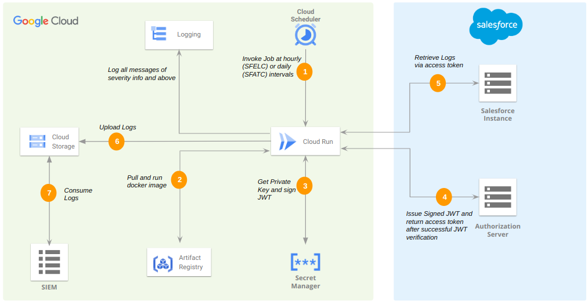

# Salesforce Logs and Audit Trails Collector

This project was created with the following objectives:
- Collect security related event logs and audit trails from a Salesforce Instance.
- Upload logs and audit trails to a Google Cloud Platform (GCP) Storage bucket where they can be consumed by a Security Information and Event Management (SIEM) appliance.

## Description

Two client applications will be deployed with each running on a Cloud Run Instance. They include a: 

- **Salesforce Event Log Collector (SFELC)**: This collects [event log files](https://developer.salesforce.com/docs/atlas.en-us.object_reference.meta/object_reference/sforce_api_objects_eventlogfile_supportedeventtypes.htm) at hourly intervals. The application downloads the latest CSV log file, converts the CSV file to JSON and uploads it to a GCP storage bucket.

- **Salesforce Audit Trail Collector (SFATC)**: This collects [audit trails](https://help.salesforce.com/s/articleView?id=sf.admin_monitorsetup.htm&type=5) at daily intervals from Salesforce. The SFATC adds the audit trail entries to a JSON file and uploads the file to a GCP storage bucket.

The architecture of the setup is shown below: 



Authorization to the Salesforce API is achieved via Oauth 2.0 JSON Web Token (JWT) bearer flow. The access token returned from authorizing against the token endpoint is used to query the API for the log information.

## Getting Started


### Assumptions & Dependencies
- You have an existing GCP project available to deploy the GCP infrastructure and the client applications.

- You have setup a connected app in Salesforce and uploaded a digital certificate required to verify the JWT signature from the SFELC and SFATC client apps. Refer [here](https://help.salesforce.com/s/articleView?id=sf.connected_app_create.htm&type=5) on how to setup a Salesforce connected app.

- You have stored the private key (that will be used by the client apps to sign the JWTs) in GCP Secret Manager.

- You are running terraform client either in GCP cloud shell or on a workstation and the client is using an account with the required IAM permissions to deploy the infrastructure in GCP. 

### Usage
This consists of 3 steps:

1. Clone the repository and populate the provided **terraform.tfvars** file with the following information:
    - `project_id`  The existing Google Project ID.

    - `secrets_project_id`  The existing project ID where the secret (private key) resides; This could be the same or different from the Project ID above.

    - `region`  The deployment region. Defaults to **northamerica-northeast1** region if not specified. 
      > [!NOTE] 
      The infrastructure components will be deployed in this region.

    - `zone`  The deployment zone. Defaults to **northamerica-northeast1-a** zone if not specified.

    - `repo_name`  The name of the Repository in Artifact Registry where the docker images will be stored/pushed.

    - `cloud_storage_bucket`  The name of the Cloud storage bucket to store log files

    - `secret_id`  The secret name or ID of the secret in GCP Secret Manager

    - `env`  Enviromental variables that will be passed by GCP Cloud Run to the client apps at runtime. They include:

      - `GOOGLE_PROJECT_ID`, `GOOGLE_SECRETS_PROJECT_ID`, `SECRET_ID` and `CLOUD_STORAGE_BUCKET` 

      - The JWT Claim Set:

          - `AUDIENCE`  The Salesforce Authorization Server Hostname

          - `SUBJECT`  Principal/User's username 

      - `TOKEN_ENDPOINT`  URL to the Authorization Token Endpoint

      - `CLIENT_ID`  Client ID to access the Salesforce Connected App.

      - `EVENT_TYPES`  The event type log files to fetch from salesforce.


2. Run `terraform init` to initialize terraform. 

```terraform
user_@cloudshell:~$ terraform init
Initializing the backend...
Initializing modules...
- docker in modules/docker
- iam in modules/iam
- serverless in modules/serverless
- storage in modules/storage

Initializing provider plugins...
```

3. Run `terraform apply -auto-approve` to deploy.

```terraform
user_@cloudshell:~$ terraform apply
Terraform used the selected providers to generate the following execution plan. Resource actions are indicated with the following symbols:
  + create

Terraform will perform the following actions:
``` 

## License
This project is licensed under the MIT License - see the LICENSE file for details
